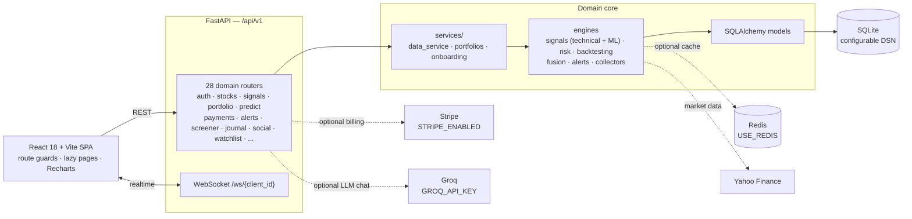

# KingStop

**An open-source trading-intelligence and paper-trading platform that runs on
your machine** — live market views, technical and ML signals, paper portfolios,
risk management, backtesting, prediction markets, social trading, and AI-assisted
research in one authenticated web app (colloquially *KingsWork*).

[](https://github.com/0xMudit/kingswork-trading-platform/actions/workflows/ci.yml)
[](./LICENSE)
[](./backend)
[](./frontend)
[](./frontend)
[](https://kingswork-ruddy.vercel.app)
[](./CONTRIBUTING.md)

> KingStop is an engineering and educational project. It is **not financial
> advice** and never executes real brokerage trades — everything happens in
> paper portfolios.

## What is it?

Trading research is scattered across brokers, charting tools, news tickers,
discord groups, and spreadsheets. KingStop closes the loop on your own machine:
every page reads from the same FastAPI `/api/v1` surface that the signal
engines, risk manager, and backtester write to, so you get one coherent view of
the whole research-to-trade loop — and a safe place to rehearse it.

- **Self-contained.** One `python` + `npm` pair boots the whole platform against
  SQLite and deterministic market fixtures. No brokerage, exchange, or API key
  required.
- **Real markets.** Optional Yahoo Finance integration streams daily data for
  US, NSE, BSE, and crypto tickers; the simulated collectors keep every feature
  demoable offline.
- **Transparent models.** Signals show their indicators, the risk manager
  reports position sizing, value-at-risk, and exposure, backtests report fills,
  commission, PnL, and drawdown, and prediction markets resolve with auditable
  CPMM math.
- **Safe by construction.** Stop-loss / take-profit defaults, position caps, and
  responsible-use guardrails ship enabled.
- **Social.** Share research through portfolios, leaderboards, feeds, streaks,
  and daily challenges — without handing over your keys.

| | |
|---|---|
| **Live demo** | https://kingswork-ruddy.vercel.app |
| **Creator portfolio** | https://mudityaraghav.vercel.app |
| **Docs** | [ARCHITECTURE.md](./ARCHITECTURE.md) · [CONTRIBUTING.md](./CONTRIBUTING.md) · [ROADMAP.md](./ROADMAP.md) |
| **Status** | Full-stack platform — CI-verified on every push |
| **License** | [MIT](./LICENSE) |


*The dashboard overview — one sign-in away from paper portfolios, signals, and live market views.*

## Highlights

| Area | What you get |
|------|--------------|
| Market data | US / NSE / BSE / crypto price views, historical + real-time workflows, index comparisons, watchlists |
| Signals & screening | Technical + ML signal engines, screeners, news, price targets, prediction-style intelligence |
| Portfolio & trading | User-owned paper portfolios, wallet, positions, trade plans, trade copy, backtests |
| Risk | Exposure, correlation matrix, market heatmap, stop-loss / take-profit, position & risk caps |
| Prediction markets | CPMM markets with positions, streaks, achievements, daily challenges |
| Social | Trading journal, social feed, market header, referrals, alerts, notifications |
| AI research | Groq-powered market assistant with the in-app KingStop chat personality |
| Intelligence stack | Fusion engine, trading-models layer, AI explain, developer reference |
| Identity | JWT bearer auth, bcrypt hashing, account preferences, security settings, guided onboarding |
| Developer surface | Versioned `/api/v1` FastAPI API with OpenAPI docs and WebSocket channels |

## Screenshots

Full-size captures live in [`assets/screenshots/`](./assets/screenshots/).

### Getting in

| | |
|---|---|
|  |  |
| **Login** — JWT-backed sign-in with bcrypt-hashed credentials and protected-route redirect on 401. | **Sign up** — guided onboarding, preferences, and security settings from day one. |
|  | |
| **Product tour** — the guided walkthrough to a user's first paper trade. | |

### Dashboard & market views

| | |
|---|---|
|  |  |
| **Dashboard overview** — URL-driven center of the app: portfolios, signals, and activity at a glance. | **Market header** — live US / NSE / BSE / crypto snapshot with index comparison. |
|  | |
| **Intelligence stack** — signals, models, and the fusion layer visualized together. | |

### Portfolio, trading & risk

| | |
|---|---|
|  |  |
| **Portfolios** — paper portfolios, wallet, positions, and trade plans. | **Leaderboard** — community standings, streaks, and achievements. |
|  |  |
| **Trade copy** — rehearse moves without real money in the loop. | **Market heatmap** — a visual sweep of sector and ticker exposure. |
|  |  |
| **Correlation matrix** — pairwise asset correlation for smarter diversification. | **Price targets** — analyst-style targets tracked alongside signals. |
|  | |
| **Guardrails** — stop-loss / take-profit defaults and position caps, on by default. | |

### Signals, markets & prediction

| | |
|---|---|
|  |  |
| **Signals marketplace** — technical and ML signals browsable like a marketplace. | **Prediction markets** — CPMM markets with auditable resolution. |

### AI chat & community

| | |
|---|---|
|  |  |
| **Groq-powered chat** — fast model responses when `GROQ_API_KEY` is configured. | **KingStop chat** — the in-app market assistant personality. |
|  | |
| **Social feed** — trading journal, shared research, and community activity. | |

### Security & developer reference

| | |
|---|---|
|  |  |
| **Security settings** — password, preferences, notifications, privacy, and self-set limits. | **Developer reference** — the API surface for building on KingStop. |

## Architecture



Every optional dependency is **off by default** (`USE_REDIS=false`,
`STRIPE_ENABLED=false`, no `GROQ_API_KEY` set), so a fresh clone runs against
SQLite and deterministic market fixtures with no external services required.
See [ARCHITECTURE.md](./ARCHITECTURE.md) for routing, state ownership, and
extension guidance.

## Tech stack

| Layer | Technologies |
|-------|--------------|
| Frontend | React 18 · TypeScript · Vite · Tailwind CSS · Radix UI · Framer Motion · Recharts · Axios |
| Backend | Python 3.11+ · FastAPI · SQLAlchemy · Pydantic · JWT (bcrypt) |
| Data | SQLite by default · optional Redis cache · simulated or Yahoo Finance market data |
| Optional integrations | Groq (AI chat) · Stripe (billing) — both disabled unless configured |

## Getting started

### Prerequisites

- Python 3.11+
- Node.js 20+
- npm

### 1. Start the API

```bash
git clone https://github.com/0xMudit/kingswork-trading-platform.git
cd kingswork-trading-platform/backend
python3 -m venv .venv
source .venv/bin/activate
pip install -r requirements.txt
cp .env.example .env
uvicorn main:app --reload --host 0.0.0.0 --port 8000
```

The API is available at http://localhost:8000, with interactive OpenAPI docs at
http://localhost:8000/docs.

### 2. Start the frontend

In a second terminal:

```bash
cd kingswork-trading-platform/frontend
npm install
npm run dev
```

Open http://localhost:5173/kingswork/. Vite proxies `/api` and `/ws` to the
local FastAPI server.

The dev database seeds demo users and sample trading data. Override all
demo/test account values in `backend/.env` for any shared deployment.

### Docker

```bash
docker compose up --build
```

Starts the API on port `8000` and the frontend on port `5173`. Review the
compose environment and reverse-proxy settings before production use.

## Environment configuration

Copy `backend/.env.example` to `backend/.env`. The app works locally with
SQLite and simulated market data; external service keys are optional.

| Group | Important variables |
|-------|---------------------|
| Core | `DATABASE_URL` · `SECRET_KEY` · `DEBUG` · `API_PREFIX` |
| Market data | `USE_LIVE_MARKET_DATA` · `YAHOO_REFRESH_INTERVAL` · `MARKET_DATA_TIMEOUT_SECONDS` |
| AI chat | `GROQ_API_KEY` · `GROQ_MODEL` · `GROQ_TIMEOUT_SECONDS` |
| Cache | `USE_REDIS` · `REDIS_URL` |
| Billing | `STRIPE_ENABLED` · `STRIPE_SECRET_KEY` · `STRIPE_PUBLISHABLE_KEY` · `STRIPE_WEBHOOK_SECRET` |
| Risk defaults | `MAX_POSITION_SIZE_PCT` · `MAX_PORTFOLIO_RISK_PCT` · `STOP_LOSS_PCT` |

Never commit `backend/.env`, databases, logs, or production credentials — all
excluded by `.gitignore`.

## API surface

The `/api/v1` surface covers authentication, accounts, market data, signals,
portfolios, alerts, trading modes, trading models, screeners, news, journals,
analytics, trading tools, social, prediction markets, marketplace, price
targets, referrals, watchlists, and payments. WebSocket routes provide live
update channels at `/ws/{client_id}`. Browse everything interactively at
http://localhost:8000/docs.

## Project structure

```text
backend/
  api/              Versioned domain routers
  auth/             JWT authentication and request dependencies
  signals/          Technical indicators and ML signal models
  risk/             Position sizing, risk scoring, exposure
  backtesting/      Fill, commission, PnL, and drawdown engine
  fusion/           Multi-signal fusion engine
  alerts/           Alert matching and dispatch
  collectors/       Market data acquisition
  models/           SQLAlchemy domain models
  services/         Shared business logic
  main.py           FastAPI application and route registration
  config.py         Typed environment configuration
frontend/
  src/components/   Trading and analytics UI
  src/features/     Navigation, onboarding, chat, feature modules
  src/pages/        Landing, authentication, documentation, dashboard
  src/routes/       Route definitions and guards
  src/services/     API client functions
assets/
  screenshots/      Product screenshots used in this README
```

## Verification

```bash
# Frontend
cd frontend
npm run typecheck
npm test
npm run build

# Backend
cd backend
python -m pytest
```

The backend suite covers the risk manager (position sizing, risk scoring,
value-at-risk) and the backtest engine (fills, commission, PnL, drawdown). CI
runs both suites plus the frontend typecheck and build on every push and pull
request.

## Contributing

Contributions are welcome — issues, docs, and pull requests alike. Start with
[`CONTRIBUTING.md`](./CONTRIBUTING.md) for setup and the reviewable-PR bar, and
[`ARCHITECTURE.md`](./ARCHITECTURE.md) for where the code lives. Roadmap work is
tracked in [`ROADMAP.md`](./ROADMAP.md). Please read the
[Code of Conduct](./CODE_OF_CONDUCT.md); it applies to every project space.

## Security

KingStop is a paper-trading and research platform and must never be connected
to a real brokerage. Keys and credentials (`STRIPE_*`, `GROQ_API_KEY`,
`SECRET_KEY`) must remain environment variables — never commit `backend/.env`,
databases, logs, or production secrets. Report vulnerabilities privately per
[`SECURITY.md`](./SECURITY.md) rather than in a public issue.

## License

[MIT](./LICENSE) — see the LICENSE file for details.